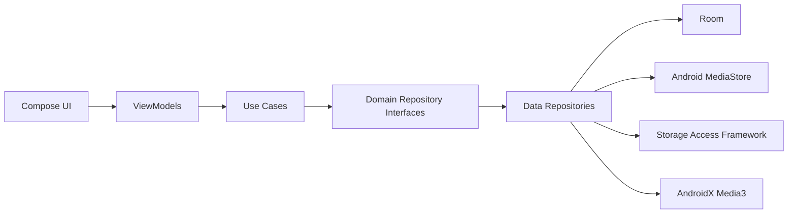

# Architecture

Local Music uses Clean Architecture with MVVM so the playback and library model can grow without coupling UI code to Android storage APIs.

## Package Direction

- `domain` contains immutable models, repository contracts, and use cases.
- `data` owns Room, MediaStore, SAF folder sources, cache, and repository implementations.
- `ui` contains Compose screens and ViewModels.
- `playback` will own Media3 session and player coordination.
- `artwork`, `bluetooth`, `search`, and `util` will hold focused feature services.

## Initial Decisions

- UI depends on use cases, never directly on MediaStore or Room.
- Room is introduced early because 50,000+ song libraries need indexed metadata, favourites, history, and playlist state.
- Media3 is reserved for playback and metadata compatibility instead of custom decoder logic.
- Dependency injection starts with explicit factories. A DI library can be added only when constructor wiring becomes repetitive enough to justify the dependency.

## Implemented Feature Slices

MediaStore scanning is implemented behind `MusicRepository`, sorted by `MediaStore.DATE_ADDED` for the default recently added view. SAF folder scanning is a separate data source merged through `CompositeMusicScanner`, then normalized by the shared duplicate detection pipeline before Room persistence.

Playback is exposed through a Media3 `MediaSessionService` and a queue factory that converts domain songs into `MediaItem`s. Playlist, artwork, settings, license, and car-mode code starts as focused services so UI screens can be added without moving business rules into Compose.

Favourites are persisted through the repository boundary and toggled from Compose via `SetFavouriteUseCase`. Song taps and Now Playing controls call `StartPlaybackUseCase`, which delegates to a domain `PlaybackController` implemented by the Media3 controller. The same playback boundary exposes Media3 playback snapshots so Now Playing can reflect current position, queue item changes, and external media-control updates without coupling Compose to Media3.

Artwork extraction is handled by a focused Android service that uses `MediaMetadataRetriever`, stores embedded artwork in a small disk cache, and exposes file URIs to UI state for thumbnail rendering. Cache pruning is separated into JVM-testable policy code.

Car Mode detection remains a focused Bluetooth service. The UI requests `BLUETOOTH_CONNECT` when required, reads bonded devices only after permission is available, and reflects likely car-audio state through `HomeUiState`.

The Compose shell uses bottom navigation for primary destinations and keeps library refresh one-shot for a ViewModel lifetime so switching tabs, changing settings, and using playback controls do not re-enumerate device media.
