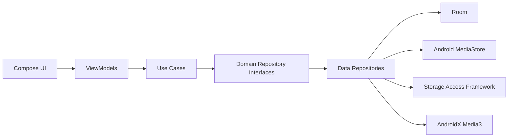

# Architecture

Local Music uses Clean Architecture with MVVM so the playback and library model can grow without coupling UI code to Android storage APIs.

## Package Direction

- `domain` contains immutable models, repository contracts, and use cases.
- `data` owns Room, MediaStore, SAF folder sources, cache, and repository implementations.
- `ui` contains Compose screens and ViewModels.
- `playback` will own Media3 session and player coordination.
- `artwork`, `bluetooth`, `search`, and `util` will hold focused feature services.

## Initial Decisions

- UI depends on use cases, never directly on MediaStore or Room.
- Room is introduced early because 50,000+ song libraries need indexed metadata, favourites, history, and playlist state.
- Media3 is reserved for playback and metadata compatibility instead of custom decoder logic.
- Dependency injection starts with explicit factories. A DI library can be added only when constructor wiring becomes repetitive enough to justify the dependency.

## Next Architecture Slice

MediaStore scanning is implemented behind `MusicRepository`, sorted by `MediaStore.DATE_ADDED` for the default recently added view. SAF folder scanning should be added as a separate data source and merged with MediaStore using the same duplicate detection pipeline.
