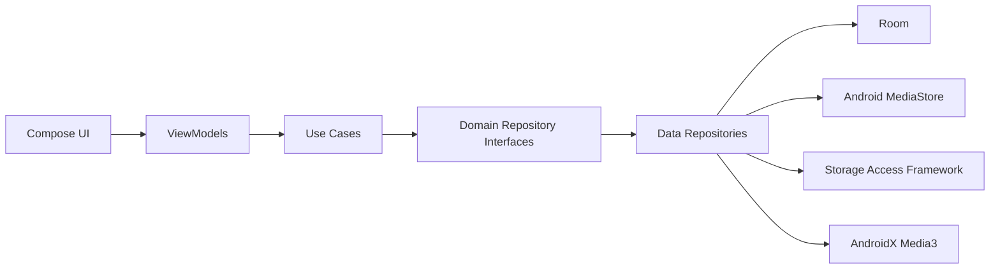

# Architecture

Local Music uses Clean Architecture with MVVM so the playback and library model can grow without coupling UI code to Android storage APIs.

## Package Direction

- `domain` contains immutable models, repository contracts, and use cases.
- `data` owns Room, MediaStore, SAF folder sources, cache, and repository implementations.
- `ui` contains Compose screens and ViewModels.
- `playback` will own Media3 session and player coordination.
- `artwork`, `bluetooth`, `search`, and `util` will hold focused feature services.

## Initial Decisions

- UI depends on use cases, never directly on MediaStore or Room.
- Room is introduced early because 50,000+ song libraries need indexed metadata, favourites, history, and playlist state.
- Media3 is reserved for playback and metadata compatibility instead of custom decoder logic.
- Dependency injection starts with explicit factories. A DI library can be added only when constructor wiring becomes repetitive enough to justify the dependency.

## Implemented Feature Slices

MediaStore scanning is implemented behind `MusicRepository`, sorted by `MediaStore.DATE_ADDED` for the default recently added view. SAF folder scanning is a separate data source merged through `CompositeMusicScanner`, then normalized by the shared duplicate detection pipeline before Room persistence.

The Room library schema retains local browsing and search metadata including artist, album, album artist, genre, composer, year, comments, description, and folder. Instant search also matches persisted playlist membership names. Scan generations reconcile deletions only after complete scans, so transient MediaStore or SAF failures cannot erase indexed songs. Schema migrations are explicit so installed libraries retain user state as metadata support expands.

Playback is exposed through a Media3 `MediaSessionService` and a queue factory that converts domain songs into `MediaItem`s. `PlaybackController` provides playback, enqueue, synchronization, and clear-queue commands so the persisted Queue playlist and active Media3 queue remain aligned. Queue persistence is serialized, controller connections retry once after transient failures, and startup restores the last selected item without auto-playing when no live Media3 queue exists. Starting a song from Home or Favourites replaces both queues with the selected playback set before playback starts. Now Playing can restart the active queue at a selected queue item without rebuilding it. Playback snapshots expose the ordered Media3 timeline as domain song IDs; `HomeViewModel` resolves those IDs against the complete unfiltered library so Now Playing can render the authoritative active playlist and position it at the current song. A Media3 PCM `AudioProcessor` publishes no-artwork visualizer levels from the app's decoded playback audio, avoiding recording permission and platform audio-effect dependencies. Playlist, artwork, settings, license, and car-mode code starts as focused services so UI screens can be added without moving business rules into Compose.

Favourites are persisted through the repository boundary and toggled from Compose via `SetFavouriteUseCase`. Song taps and Now Playing controls call `StartPlaybackUseCase`, which delegates to a domain `PlaybackController` implemented by the Media3 controller. The same playback boundary exposes Media3 playback snapshots so Now Playing can reflect current position, queue item changes, external media-control updates, and shuffle/repeat state without coupling Compose to Media3. Compose can open Android's optional system equalizer panel when a compatible device panel is available; it does not implement audio effects itself.

Artwork extraction is handled by a focused Android service that uses `MediaMetadataRetriever`, stores embedded artwork in a small disk cache, and exposes file URIs to UI state for thumbnail rendering. Cache pruning is separated into JVM-testable policy code. Settings reports the cache size and can clear its artwork directory; the ViewModel clears stale thumbnail URI state so artwork can be resolved again on demand.

Artwork settings are isolated in `ArtworkPreferences`, a small SharedPreferences-backed boundary. The external-artwork preference defaults to disabled and gates only an optional MusicBrainz and Cover Art Archive metadata lookup after embedded art, `folder.jpg`, `cover.jpg`, and a previously downloaded image fail. Artwork ingestion and downloads are byte-bounded, decoded at display-oriented sample sizes, and written through synchronized cache operations. The visualizer preference defaults to artwork and can instead make the Now Playing visualizer the initial display even when artwork exists. Local artwork is resolved before any network request and published before optional downloads begin. Successful online artwork bytes are stored in app-private persistent storage so they remain available after restarting; requests are rate-limited and never provide audio playback or a cloud library.

Playlists are stored as one Room row per playlist so individual updates do not rewrite the full collection. The first Room load migrates legacy SharedPreferences playlists when the Room table is empty. M3U imports and exports use bounded, background document I/O. The playlist editor resolves user-entered HTTP(S) streams and remote M3U URLs in the data layer with bounded `HttpURLConnection` reads and strict web-scheme validation. Each resolved station is a first-class `SongEntity` with `SongSource.STREAM`: its URI is retained as `fileName`, it appears in the shared library, and ordinary SongDao favourites, playback history, search, and Media3 metadata updates apply. Stream rows use URI-based upserts and survive local scan reconciliation, which deletes only stale `LOCAL` rows. A remote M3U expands into deduplicated HTTP(S) station entries before the playlist is saved; playlist playback resolves all entries through the common library rather than synthesizing transient songs.

Radio Browser search follows the same boundary: `RadioStationDirectory` is implemented by a bounded data-layer client that requests active stations from Radio Browser replicas, parses structured JSON, and accepts only resolved HTTP(S) stream URLs. Compose receives immutable search state from `HomeViewModel` and sends actions back through callbacks. Selecting Play or Add to Playlist first persists the directory result as a normal stream song, so favourites, history, metadata updates, queue playback, and playlist storage all use the established shared-library path. Remote favicon URLs are rendered by Coil from the UI model without exposing networking to the Compose route.

Google Cast uses the official sender framework and Default Media Receiver. Now Playing exposes the standard Cast route chooser only for HTTP(S) `SongSource.STREAM` items; local MediaStore and SAF content is never advertised or served. The proprietary Google Play services Cast dependency is a narrow exception to the open-source dependency preference because compatible Chromecast built-in devices require the official sender stack. `GoogleCastRemoteStreamController` loads the prepared stream URI and publishes request-keyed receiver state. `HomeViewModel` transfers playback ownership only after the receiver reports `PLAYING` for the current song ID and URI, pauses local Media3 exactly once, and routes subsequent play/pause commands remotely without auto-resuming after errors or disconnects.

Radio Browser favicons are persisted as optional stream-song artwork URIs. They are projected into the existing artwork state used by playlist rows, the compact player, and Now Playing, while local artwork extraction remains responsible for local-file songs.

Radio Browser search is scoped to the playlist editor that opened it. A result can be appended directly to that playlist or used to create a new playlist. Tapping a result pauses the shared playback session and starts a separate one-item preview player; the preview state exposes its station title and explicit stop action without replacing the main Media3 queue.

Media3 uses a bounded load-error policy for HTTP(S) stream reads, retrying transient connection failures after one, two, and four seconds. Local media retains Media3's default error handling. When the remote retry limit is exhausted, the normal terminal playback error remains available to the `PlaybackController` and UI.

Library startup defaults are isolated in `LibraryPreferences`, another small SharedPreferences-backed boundary. It persists explicit Settings choices for the default library filter and sort order, restores them when `HomeViewModel` is created, and falls back to the built-in values when stored enum data is missing or invalid.

Settings renders application version information from generated `BuildConfig` data and reads bundled third-party notices from the focused `OpenSourceLicenses` registry. This static information remains outside the ViewModel because it neither changes user state nor accesses storage or media APIs.

Library browsing uses a typed `LibraryQuery` through the repository boundary. Room applies filters, browse values, and supported sort orders before a Paging 3 source materializes 100-song pages; the pager prefetches 20 rows, enables placeholders, and caps retained pages at 500 songs. Compose renders `LazyPagingItems` without accumulating every visited page in `HomeViewModel`. Room also aggregates artist, album, genre, and folder facets across the complete filtered query rather than the loaded page. Playlist and queue commands resolve their entry URI sets through targeted repository lookups, so playback does not require a complete UI-state library snapshot. Schema version 10 applies `NOCASE` collation to sortable text columns so composite indexes cover the actual favourite, play-history, artist, album, genre, folder, title, and duration browse/sort SQL. A 50,000-row instrumentation test verifies those production query plans. Contains search remains SQL-bound but uses `LIKE` across persisted metadata, so it is not B-tree indexed.

Car Mode detection remains a focused Bluetooth service. The Compose route owns the `BLUETOOTH_CONNECT` permission boundary and registers an A2DP connection receiver only while access is available; profile snapshots refresh connected-device state in `HomeViewModel`. `CarModePreferences` keeps an explicit manual override, user-marked device IDs, and a default-enabled display-awake policy independently of Bluetooth-class detection. The ViewModel distinguishes an actual likely or user-marked car-audio connection from manually enabled Car Mode. While the policy is enabled, the Compose route observes the sticky battery status and keeps its root view awake only while charging or connected to detected car audio, clearing the flag when the condition ends or the route is disposed. Active Car Mode preserves the MiniPlayer's full-width transport row while using 80 dp targets and additional spacing without displaying a persistent mode heading. The activity hides only the system status bar while the compact player is visible and restores it when the player is absent or the full Now Playing screen is open.

The Compose shell uses bottom navigation for primary destinations and keeps library refresh one-shot for a ViewModel lifetime so switching tabs, changing settings, and using playback controls do not re-enumerate device media.

Selected SAF folders are persisted by the data-layer `SafFolderSourceStore` and changed through `MusicRepository` use cases. `HomeViewModel` exposes their current list as UI state and reloads it after a source mutation. The Compose route owns the Android activity-result and `ContentResolver` permission boundary, acquiring a persisted read grant on selection and releasing it when the user removes that folder in Settings.

The home UI keeps routing, permissions, and shared navigation chrome in `HomeScreen.kt`. Destination rendering is split into focused Compose files under `ui/home`: `LibraryScreen.kt`, `PlaylistScreen.kt`, `SettingsScreen.kt`, and `NowPlayingScreen.kt`. Reusable song-list, empty-state, and playlist-creation controls live in `HomeComponents.kt`, `PlayerComponents.kt` owns the compact global mini-player, and `ArtworkComponents.kt` owns artwork thumbnail, backdrop, and no-artwork visualizer rendering. `HomeRoute` constructs immutable, feature-focused capabilities in `HomeActions.kt` from `HomeViewModel` commands and passes them explicitly to destination surfaces. `PlaybackActions` centralizes player commands, while library, song, playlist, radio, and settings capabilities prevent repeated callback expansion without introducing global mutable access. Shared song lists derive a narrower `SongListActions` capability, and Now Playing projects its broad screen state into one private orientation-independent render model. Both player progress sliders keep drag state locally and forward a single seek on release through the playback use case rather than exposing Media3 to Compose. Now Playing owns a directional cover transition and axis-locks cover gestures: horizontal dragging changes queue items, while vertical dragging changes Android's global media-stream volume through `AudioManager`. A lifecycle-bound system-settings observer keeps the read-only volume indicator synchronized with hardware volume controls. In portrait, direct playlist dragging can collapse the artwork to half height while automatic current-song positioning leaves it expanded. In landscape, controls overlay the artwork and remain bottom-aligned so transport actions stay visible in short windows without using the portrait collapse behavior.
